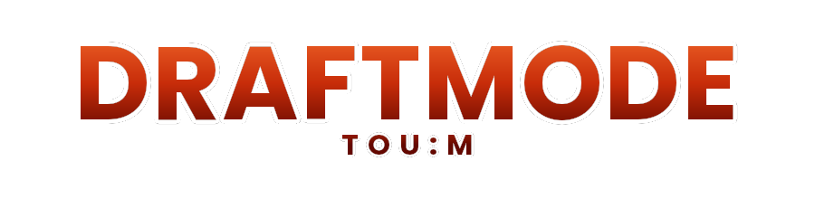
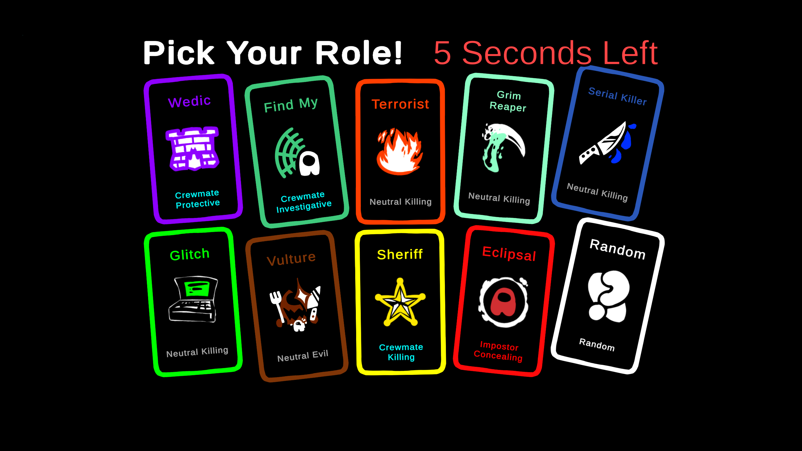
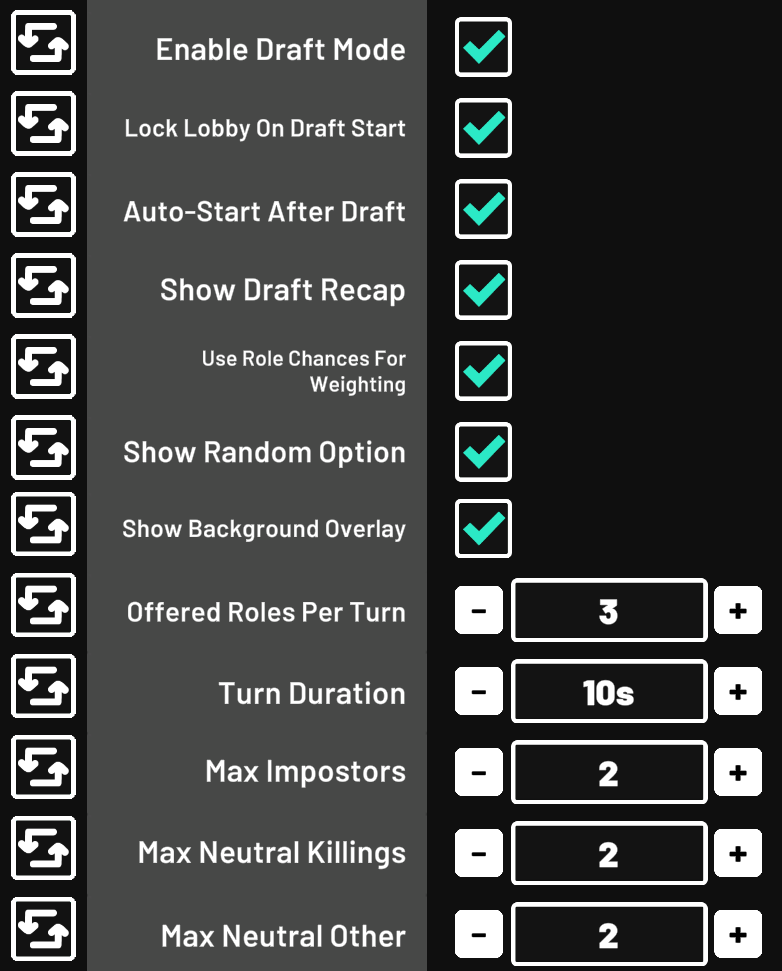
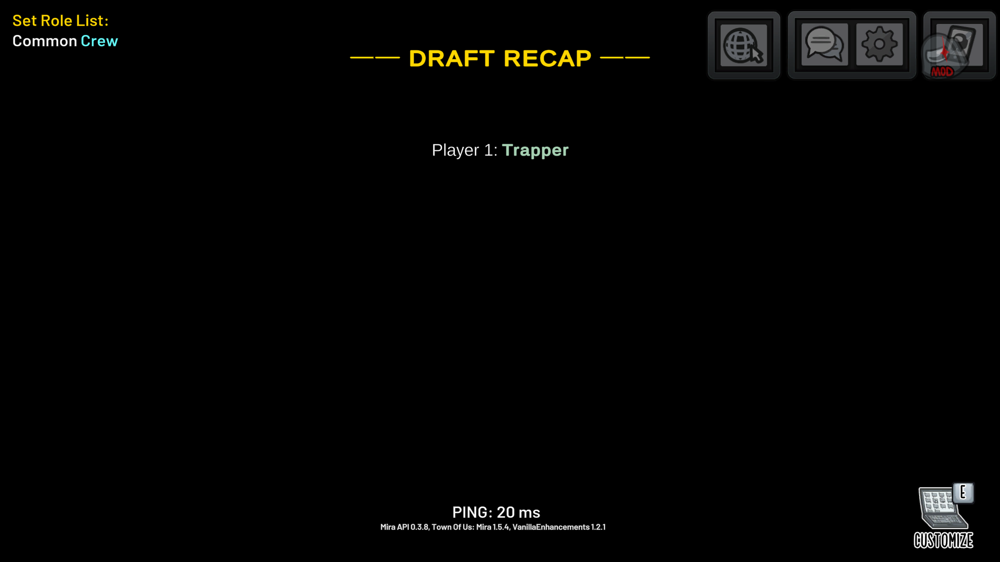

  

A [BepInEx](https://github.com/BepInEx/BepInEx) mod for **Among Us** running [Town of Us: Mira Edition (TOUM)](https://github.com/AU-Avengers/TOU-Mira) that adds a **Draft Mode** — players take turns picking their roles before the game begins instead of having them assigned randomly.

---

## Requirements

- Among Us (compatible version with TOUM)
- [BepInEx IL2CPP](https://github.com/BepInEx/BepInEx)
- [Reactor](https://github.com/NuclearPowered/Reactor)
- [Town of Us: Mira Edition](https://github.com/AU-Avengers/TOU-Mira)

---

## Installation

1. Make sure BepInEx, Reactor, and TOUM are already installed and working.
2. Download the latest `DraftModeTOUM.dll` from [Releases](../../releases).
3. Drop it into your `BepInEx/plugins/` folder.
4. Launch Among Us — the mod will load automatically.

---

## How It Works

### Starting a Draft

Only the **Host** can start a draft. Once everyone is in the lobby, the host can press the **Start** button (auto-starts the draft)

This kicks off the draft sequence:

1. Each player is assigned a random **slot number** (their turn order).
2. The role pool is built from the host's current TOUM role settings.
3. Players pick in slot order. The host can allow **1 or 2** players to pick at the same time via the Concurrent Picks setting.

---

### Taking Your Turn

When it's your turn, a role picker UI will appear. Choose one of the offered roles - or pick **Random** to be 
assigned any available role from the pool. Other players will see a waiting screen showing who is currently picking. If concurrent picks are enabled, the waiting screen shows **MULTI** while more than one player is picking.

If the timer runs out before you pick, a random role is automatically assigned and the draft moves on.

---

## UI

Roles are presented as large clickable cards spread across the screen. Each card shows the role name, faction, and icon with a colored glow.

---

## Draft Settings

The host can configure Draft Mode from the **Mira settings menu** in the lobby. All options are synced to all players.

Key settings:
- Offered Roles Per Turn
- Concurrent Picks Per Turn (1 or 2)
- Turn Duration
- Auto-start After Draft
- Show Draft Recap
---

## Draft Recap

After every player has picked, a **Draft Recap** is shown on screen for all players, listing each pick slot and the role they chose. Role names are color-coded by their in-game color for easy readability.

The recap can be toggled off so roles stay secret — only the player who picked knows what they got. To toggle it, the host can use the **Show Draft Recap** option in settings
---

## Chat Commands

| Command | Who | Description |
|---|---|---|
| `/draftend` | Host only | Cancels the currently active draft |

---

## Local Settings

Each player can override the host's UI style choice for themselves. Open **Settings → Mira → Draft Mode** to find:

| Setting | Description |
|---|---|
| Override UI Style | When ON, ignores the host's style setting and uses your own preference |
| Use Circle Style | The style to use when Override is ON. Off = Cards, On = Circle |

This means every player in the lobby can independently use whichever picker style they prefer, regardless of what the host has configured.

---

## Role Pool

The roles available to be drafted are controlled by the host's **TOUM Role Settings**. Only roles with a non-zero count and non-zero chance will appear in the pool. The following roles are permanently banned from the draft regardless of settings:

- Haunter
- Spectre
- Pestilence
- Mayor
- HnS Roles
- Traitor

Faction caps (Max Impostors, Max Neutral Killings, Max Neutral Other) are applied globally across the entire draft — once a cap is hit, no more roles of that faction will be offered to any player.

---

## License

MIT

